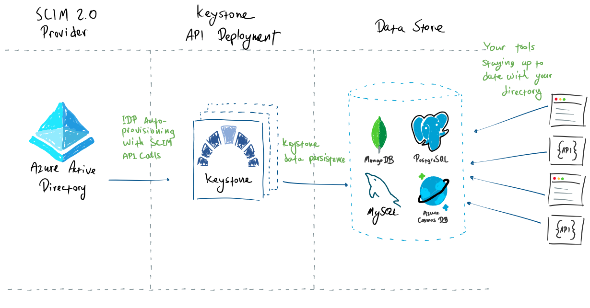

<div align="center">
    
    <h1>Keystone</h1>
    <a href="https://github.com/keystone-scim/keystone/releases">
        
    </a>
    <a href="https://github.com/keystone-scim/keystone/actions/workflows/docker_build.yaml">
        
    </a>
    <a href="https://github.com/keystone-scim/keystone/actions/workflows/unit_tests.yaml">
        
    </a>
    <a href="https://github.com/keystone-scim/keystone/actions/workflows/integration_tests.yaml">
        
    </a>
    <a href="./LICENSE">
        
    </a>
    <a href="https://keystone-scim.github.io">
        
    </a>
    <hr />
</div>

**Keystone** is a fully containerized lightweight SCIM 2.0 API implementation.

## Getting Started

Run the container with zero config to test it:

```shell
# Pull the image:
docker pull ghcr.io/keystone-scim/keystone:latest

# Run the container:
docker run -it \
  -p 5001:5001 \ 
  -e AUTHENTICATION_SECRET=supersecret \
  ghcr.io/keystone-scim/keystone:latest
```

Read the [Keystone documentation](https://keystone-scim.github.io) to understand how you can configure Keystone with
its different backends.

**What's Keystone?**

**Keystone** implements the SCIM 2.0 REST API.  If you run your identity management
operations with an identity manager that supports user provisioning (e.g., Azure AD, Okta, etc.),
you can use **Keystone** to persist directory changes. Keystone v0.1.0 supports two
persistence layers: PostgreSQL and Azure Cosmos DB.

<div align="center">
    
</div>


Key features:

* A compliant [SCIM 2.0 REST API](https://datatracker.ietf.org/doc/html/rfc7644)
  implementation for Users and Groups.
* Stateless container - deploy it anywhere you want (e.g., Kubernetes) and bring your own storage.
* Pluggable store for users and groups. Current supported storage technologies:
  * [Azure Cosmos DB](https://docs.microsoft.com/en-us/azure/cosmos-db/introduction)
  * [PostgreSQL](https://www.postgresql.org) (version 10 or higher)
  * [MongoDB](https://www.mongodb.com/docs/) (version 3.6 or higher)
* Azure Key Vault bearer token retrieval.
* Extensible store: Can't use Cosmos DB or PostgreSQL?  Open an issue and/or consider
[becoming a contributor](./CONTRIBUTING.md).

## Configure the API

See [Keystone Documentation](https://keystone-scim.github.io).

## Development

Please see the [Contribution Guide](./CONTRIBUTING.md) to get started.
